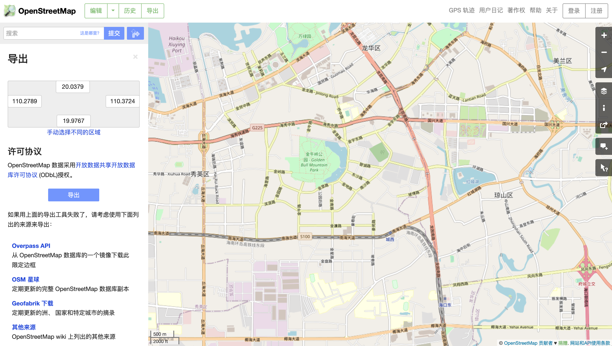
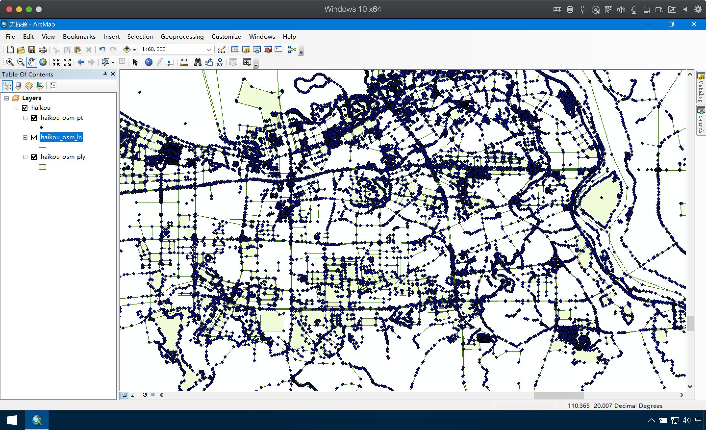
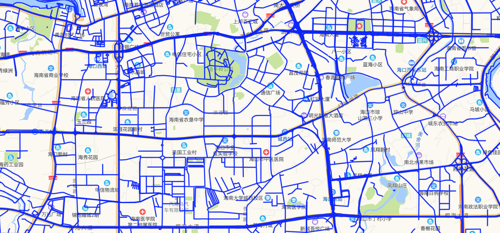
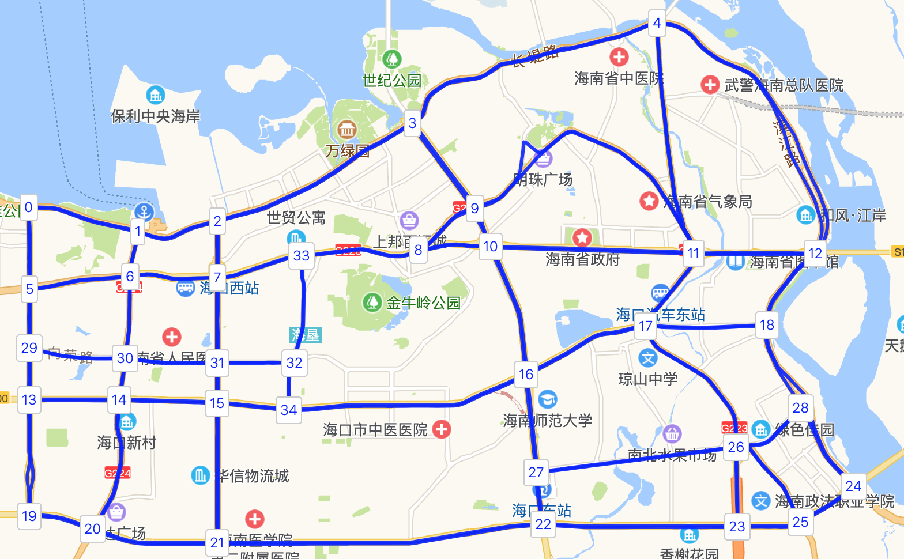
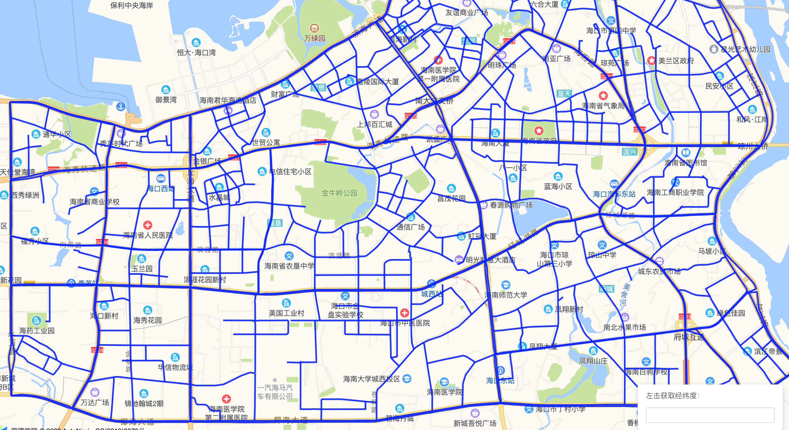
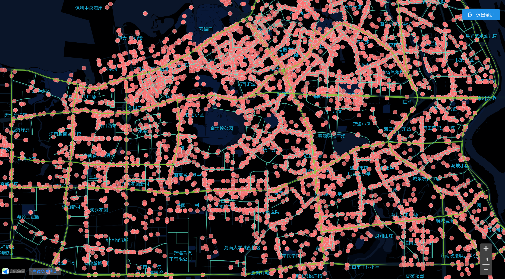

## 基于OpenStreetMap建立海口市网络仿真

在许多场景下，需要建立一个能够用于仿真的城市路网，而建立可以用于仿真的城市网络是一件非常繁杂的事情，这个文档将介绍如何建立可以用于仿真的城市路网。

该文档正在编辑中，后续将逐步完善。

### 获得路网基础

该步骤参考：xxx

在OpenStreetMap

基于

### 建立城市主干道

### 数据预处理

#### 网络冗余处理

删除短

#### 网络延长连接

### 网络最终建模

#### 网络建模情况

最终建立的网络模型如下，所有的路径均已经连接，可以通过多层规划算法直接规划出最短路径，并基于此模型进行仿真。

#### 实际应用

海口市滴滴订单的需求统计，可以看到绝大部分的订单都在路径周边

